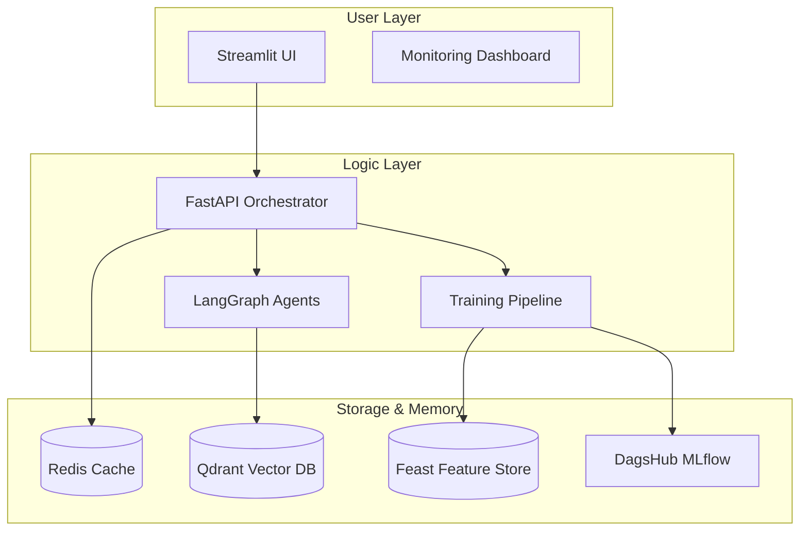

# 📈 MLOps Pipeline: End-to-End Weekly Stock Report Generation

[](https://github.com/kmeanskaran/mlops-pipeline/blob/main/LICENSE)
[](https://www.python.org/downloads/)
[](https://docs.docker.com/compose/)
[](https://feast.dev/)
[](https://mlflow.org/)

> **Design an end-to-end automated system for weekly stock market analysis using Transfer Learning (LSTM) and Agentic AI (LangGraph).**

---

## 🌟 Overview

This project is a production-grade MLOps pipeline that automates the entire lifecycle of stock price prediction and financial reporting. It shifts from traditional monolithic ML scripts to a modular, scalable architecture using modern MLOps tools.

### Key Capabilities:
- **🧠 Transfer Learning**: Uses a Parent-Child architecture (S&P 500 base model) to predict individual stock prices accurately with minimal data.
- **🤖 Agentic AI**: A multi-agent system (LangGraph) that acts as a financial analyst, market expert, and editor to generate Bloomberg-quality reports.
- **📖 Deep Learning & Design**: Explore the [In-depth System Design Guide](./doc/system_design.md) for a technical breakdown.
- **⚡ Real-time Serving**: Low-latency predictions powered by FastAPI and Redis caching (1-day TTL).
- **🍽️ Feature Store**: Consistent data management for training and serving using **Feast**.
- **🔍 Observability**: Full-stack monitoring with Prometheus, Grafana, and Evidently AI for data drift detection.

---

## 🏗️ Technical Architecture



---

## 🛠️ Tech Stack

| Component | Technology |
| :--- | :--- |
| **Model** | PyTorch (LSTM) |
| **LLM Engine** | Ollama (`gpt-oss:20b-cloud`) |
| **Embeddings** | Ollama (`nomic-embed-text`) |
| **AI Agents** | LangGraph, LangChain |
| **Feature Store**| Feast |
| **Registry** | MLflow (via DagsHub) |
| **Vector DB** | Qdrant (Semantic Caching) |
| **Cache** | Redis Stack |
| **Backend** | FastAPI (Async) |
| **Frontend** | Streamlit |
| **Observability**| Prometheus, Grafana, Evidently AI |

---

## 🚀 Quick Start

### 1. Prerequisites
- [Docker & Docker Compose](https://docs.docker.com/get-docker/)
- [Ollama](https://ollama.com/) (Running on host machine)
- [FINHUB](https://finnhub.io/) (Get FinnHub API key)
- [UV](https://docs.astral.sh/uv/guides/install-python/) (UV package manager for Python

#### Install Ollama Models
1. LLM: GPT-oss:20b Cloud - `gpt-oss:20b-cloud`
2. EMBEDDINGS: nomic-embed-text - `ollama pull nomic-embed-text`

### 2. Configure Environment
Create a `.env` file in the root:
```bash
# DagsHub Tracking
# DagsHub Configuration for Remote MLflow Tracking
DAGSHUB_USER_NAME=
DAGSHUB_REPO_NAME=
DAGSHUB_TOKEN=
MLFLOW_TRACKING_URI=
REDIS_HOST=localhost
REDIS_PORT=6379
GOOGLE_API_KEY=
FMI_API_KEY=
```

### 3. Spin up the Stack
You can use the provided automation script to build and launch all services at once:

```bash
# Give execution permission
chmod +x run_docker.sh

# Run the deployment script
./run_docker.sh
```

Alternatively, use pure Docker Compose:
```bash
docker-compose up --build -d
```

### 4. Access the Applications
- **Streamlit UI**: `http://localhost:8501`
- **Monitoring App**: `http://localhost:8502`
- **Grafana**: `http://localhost:3000` (admin/admin)

---

## 🤖 Agentic AI Workflow

The system employs 4 specialized agents coordinated by **LangGraph**:

1. **Performance Analyst**: Interprets raw LSTM forecasts and technical indicators.
2. **Market Expert**: Scrapes latest news and sentiment using Yahoo Finance tools.
3. **Report Generator**: Synthesizes data into a professional financial markdown report.
4. **Critic**: Reviews the output for consistency and logic before final serving.

**Semantic Caching**: Reports are embedded and stored in **Qdrant**. If a similar query (95%+ match) is requested within 24 hours, the system serves the cached report instantly.

---

## 📊 MLOps Practices

- **Auto-Healing**: The API detects missing models and triggers training automatically.
- **Model Registry**: Every training run is logged to DagsHub with artifacts (scalers, plots, metrics).
- **Drift Detection**: Evidently AI runs scheduled checks to detect feature drift in stock data.
- **Transfer Learning**:
  - `Parent`: Trained on `^GSPC` (S&P 500)
  - `Child`: Fine-tuned on specific tickers like `NVDA`, `AAPL`, or `GOOG`.

---

## 🤝 Connect & Support

If you find this project helpful, let's connect!

<a href="https://x.com/kmeasnskaran" target="_blank">
    
</a>
<a href="https://linkedin.com/in/kmeanskaran" target="_blank">
    
</a>
<a href="https://kmeanskaran.substack.com" target="_blank">
    
</a>
<a href="https://buymeacoffee.com/kmeanskaran" target="_blank">
    
</a>

---

## 📜 License

Distributed under the MIT License. See `LICENSE` for more information.

---

Created with ❤️ by **Karan**
