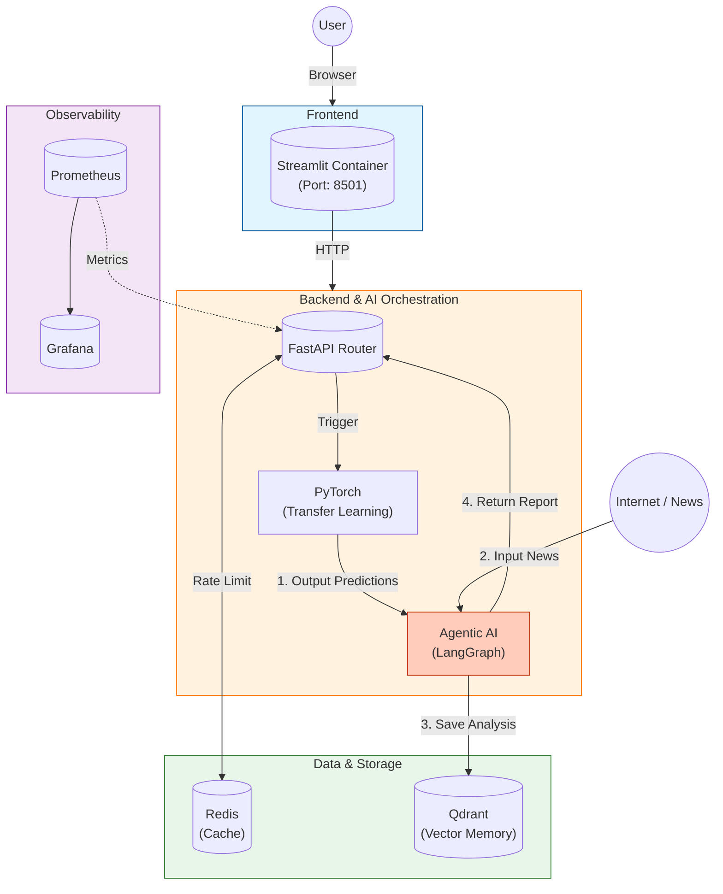

# Local Technical Architecture

This document maps the application's logical components to the local Docker Compose infrastructure. It aligns strictly with the modular breakdown of the system.

---

## Master Architecture Diagram

---

## Component Details

### 1. Streamlit UI
Interacts with the User and visualizes results. Polling mechanism allows asynchronous feedback for long-running training jobs.

### 2. FastAPI Backend
The central nervous system.
- **Rate Limit**: Uses Redis to count requests per minute/day.
- **Task Runner**: Offloads `train_child` to background threads to keep the API responsive.

### 3. Feature Store (Feast)
- **Offline**: Stores historical data for training (Parquet).
- **Online**: Serves low-latency feature vectors for inference.

### 4. Training Pipeline
Implements **Transfer Learning**:
- Loads generic market knowledge from the Parent Model.
- Freezes LSTM layers.
- Trains only the specific ticker's behavior in the details.

### 5. Inference Pipeline
Robust Serving:
- Checks disk for models.
- If missing, auto-triggers training.
- Uses Feast for point-in-time correct features.

### 6. Tracking (MLflow)
Every single training run is logged. We use DagsHub as the remote server to store artifacts and visualize loss curves.

### 7. Agentic AI
A **LangGraph** workflow powered by **Ollama**:
- **Analyst**: Looks at numbers.
- **Expert**: Looks at news.
- **Critic**: Ensures quality.
- **Qdrant**: Acts as the "Long Term Memory" to recall past analyses.

### 8. Storage Services
- **Redis**: Ephemeral data (Cache, Locks, Counters).
- **Qdrant**: Persistent Semantic Vectors.

### 9. Observability
- **Prometheus**: Scrapes metrics.
- **Grafana**: Visualizes health.
- **Agent Eval**: Quality assurance for the AI responses.
