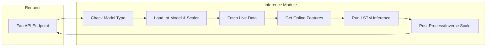
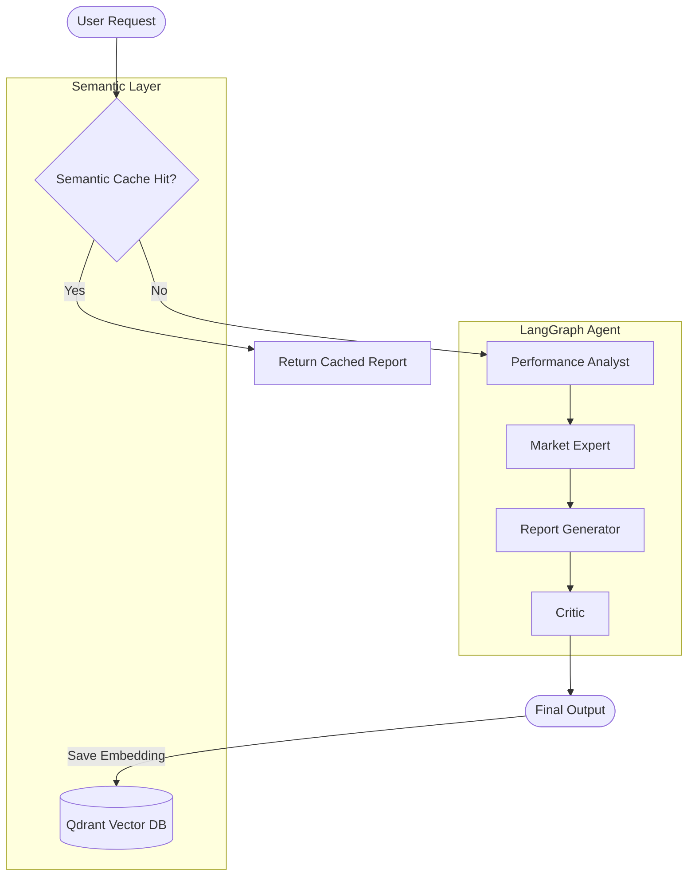
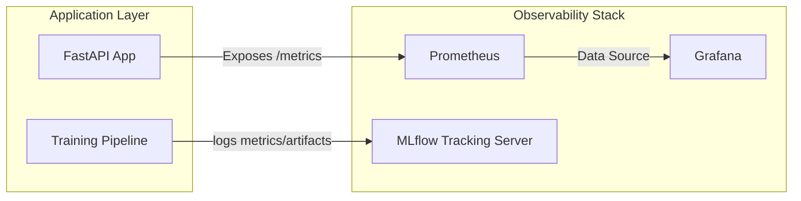

# System Modules Documentation

This document provides a detailed overview of the core modules in the MLOps Stock Prediction Pipeline. It covers Data Ingestion, Feature Engineering, Transfer Learning, Inference, API Architecture, Agentic AI, and Observability.

---

## 1. Data Ingestion, Feature Engineering & Feature Store

This module is responsible for acquiring raw financial data, transforming it into meaningful features, and serving these features for both training and low-latency inference.

### **Overview**
*   **Data Ingestion**: Raw OHLCV (Open, High, Low, Close, Volume) data is fetched from external sources (e.g., Yahoo Finance via `yfinance`).
*   **Feature Engineering**: Raw data is processed to generate technical indicators such as RSI (Relative Strength Index), MACD (Moving Average Convergence Divergence), and Moving Averages.
*   **Feature Store (Feast)**: 
    *   **Offline Store**: Used for generating historical training datasets.
    *   **Online Store**: (Redis) Used to serve the most recent feature values for real-time inference, ensuring training-serving skew is minimized.

### **Workflow**
1.  **Fetch**: `src/data/ingestion.py` pulls data from YFinance.
2.  **Transform**: Technical indicators are calculated.
3.  **Store**: Features are registered in the Feature Store (defined in `feature_repo/`).
4.  **Serve**: The Inference Pipeline queries Feast for the latest "online" features to feed into the model.

### **Architecture Diagram**

```mermaid
graph LR
    subgraph Data Sources
    YF[Yahoo Finance]
    end

    subgraph Data Processing
    Ingest[Ingestion Script]
    FeatEng[Feature Engineering]
    end

    subgraph Feature Store (Feast)
    Offline[Offline Store (Parquet)]
    Online[Online Store (Redis)]
    Registry[Registry]
    end

    subgraph Consumers
    Train[Training Pipeline]
    Infer[Inference Pipeline]
    end

    YF --> Ingest
    Ingest --> FeatEng
    FeatEng --> Offline
    FeatEng --> Online
    
    Offline --> Train
    Online --> Infer
```

---

## 2. Transfer Learning (Stock & GSPC)

To handle the scarcity of data for individual stocks and improve convergence speed, the system employs **Transfer Learning**.

### **Overview**
*   **Parent Model**: A base LSTM model is trained on a broad market index, specifically the S&P 500 (`^GSPC`). This model learns general market dynamics and feature patterns.
*   **Child Model**: When training for a specific stock (e.g., `AAPL`), the system initializes the model with the weights from the pre-trained Parent Model.
*   **Strategies**:
    *   **Freeze**: The LSTM layers are frozen, and only the final dense layers are retrained.
    *   **Fine-Tune**: The entire network is allowed to update, but typically with a smaller learning rate to preserve the learned representations.

### **Module: `src/pipelines/training_pipeline.py`**
*   **`train_parent()`**: Fetches GSPC data, trains an LSTM, and saves the "Parent" artifact.
*   **`train_child(ticker)`**: Loads the "Parent" artifact, initializes a new model with those weights, and trains on the specific `ticker` data.

### **Architecture Diagram**

```mermaid
graph TD
    subgraph Parent Training
    GSPC[S&P 500 Data] --> TrainParent[Train Parent LSTM]
    TrainParent --> SaveParent[Save Parent Weights]
    end

    subgraph Child Training (Transfer Learning)
    TickerData[Target Stock Data] --> LoadParent[Load Parent Weights]
    LoadParent --> InitChild[Init Child Model]
    InitChild --> FineTune[Fine-Tune on Target Data]
    FineTune --> SaveChild[Save Child Model]
    end

    SaveParent -.-> LoadParent
```

---

## 3. Inference Pipeline

The Inference Pipeline serves predictions by loading the appropriate model artifacts and combining them with live data.

### **Overview**
This module (`src/pipelines/inference_pipeline.py`) handles the end-to-end flow of a prediction request.
1.  **Model Loading**: It attempts to load the specific Child Model for the requested ticker. If not found (or if requested specifically), it falls back to the Parent Model.
2.  **Data Retrieval**: Fetches the most recent market data.
3.  **Feature Retrieval**: Optionally connects to the Feast Online Store to augment the input with pre-computed features.
4.  **Prediction**: Runs the data through the LSTM model (forecasts next-day and 7-day trends) and inverse-transforms the output using the associated Scaler.

### **Architecture Diagram**



---

## 4. FastAPI Architecture

The core application server is built with **FastAPI**, designed for high performance and asynchronous processing.

### **Overview**
*   **Entry Point**: `main.py`
*   **Asynchronous Tasks**: Heavy operations like Model Training are offloaded to background threads (`ThreadPoolExecutor`) to prevent blocking the main API loop.
*   **Task Management**: Uses **Redis** to store the status of background tasks (`running`, `completed`, `failed`), enabling long-polling or status checks by the frontend.
*   **Middleware**: CORS middleware allows communication with the Streamlit frontend.
*   **Endpoints**:
    *   `/predict-child`: Triggers inference; if a model is missing, it can auto-trigger training.
    *   `/train`: Manually starts a training job.
    *   `/status`: Checks the progress of a background task.
    *   `/agent/chat`: Invokes the AI Agent.

### **Architecture Diagram**

```mermaid
graph TD
    Client[Client / Frontend]
    
    subgraph FastAPI App
    Router[Request Router]
    
    subgraph Endpoints
    E_Pred[Predict Endpoint]
    E_Train[Train Endpoint]
    E_Agent[Agent Endpoint]
    end
    
    subgraph Background Workers
    Pool[Thread Pool Executor]
    Worker[Training Logic]
    end
    
    subgraph State Management
    Redis[Redis (Task Status & Cache)]
    end
    
    end

    Client --> Router
    Router --> E_Pred
    Router --> E_Train
    Router --> E_Agent
    
    E_Train --> Pool
    Pool --> Worker
    Worker -- Update Status --> Redis
    E_Pred -- Check Cache --> Redis
    E_Pred -- Read Status --> Redis
```

---

## 5. Agentic AI Design

The system employs a sophisticated Agentic AI system rooted in **LangGraph** to perform stock analysis.

### **Overview**
The agent is composed of a graph of specialized nodes working in concert.
*   **Semantic Caching (Qdrant)**: Before running the expensive agent, the system checks **Qdrant** for a semantically similar query (e.g., "Analysis for AAPL") processed recently. If a high-confidence match is found, the cached report is returned.
*   **Nodes**:
    1.  **Performance Analyst**: Analyzes technical data and model predictions.
    2.  **Market Expert**: Searches for news and sentiment.
    3.  **Report Generator**: Synthesizes findings into a final markdown report.
    4.  **Critic**: Reviews the report for quality and consistency.

### **Architecture Diagram**



---

## 6. Observability

Observability is integrated to monitor system health, model performance, and resource usage.

### **Overview**
*   **Prometheus**: Scrapes metrics exposed by the FastAPI app (via `prometheus-fastapi-instrumentator`). Metrics include request latency, error rates, and custom counters (e.g., `redis_cache_hit_total`).
*   **Grafana**: Visualizes the metrics from Prometheus in dashboards.
*   **MLflow**: Tracks model training experiments, parameters, metrics (MSE, RMSE), and artifacts (model files).
*   **DagsHub**: (Optional) Used as a remote MLflow tracking server and artifact registry.

### **Architecture Diagram**


