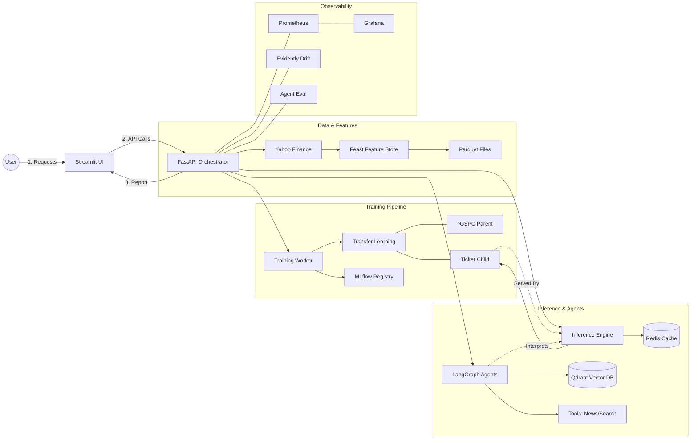

# MLOps Stock Pipeline: System Design & Workflow

This document provides a comprehensive overview of the **MLOps Stock Pipeline**, covering its high-level architecture, low-level workflows, and the integration of various MLOps components.

---

## 1. High-Level Architecture

The system is designed as a modular, scalable MLOps platform for stock market prediction and analysis. It integrates automated data pipelines, transfer learning models, multi-agent AI systems, and robust monitoring.

### Core Components:
- **Frontend**: Streamlit-based UI for users to Request analysis and view results.
- **Backend (API)**: FastAPI server orchestrating training, inference, and agent tasks.
- **Feature Store**: **Feast** for consistent data management between training and serving.
- **Model Registry & Tracking**: **MLflow** (hosted on **DagsHub**) for experiment tracking and artifact storage.
- **Database Layer**:
    - **Redis**: For rate limiting, task status tracking, and high-speed prediction caching.
    - **Qdrant**: Vector database for semantic caching/memory of AI agent reports.
- **Monitoring**: 
    - **Prometheus & Grafana**: System and application metrics.
    - **Evidently AI**: For data drift detection.
- **Compute Orchestration**: Docker Compose (Local) and Kubernetes (Production).

---

## 2. Tech Stack Detail

| Layer | Tools |
| :--- | :--- |
| **Language** | Python 3.10+ |
| **ML Framework** | PyTorch (LSTM), Scikit-learn (Preprocessing) |
| **LLM Orchestration** | LangGraph, LangChain |
| **API Framework** | FastAPI, Uvicorn |
| **Frontend** | Streamlit |
| **Databases** | Redis (Cache), Qdrant (Vector DB) |
| **Feature Store** | Feast |
| **DevOps/MLOps** | MLflow, DagsHub, Docker, K8s, Terraform, Helm |
| **Observability** | Prometheus, Grafana, Evidently AI |

---

## 3. Detailed Workflow Diagram

---

## 3. Low-Level Component Workflows

### 3.1 Data Ingestion & Feature Engineering
1.  **Ingestion**: `fetch_ohlcv` retrieves historical price data from Yahoo Finance.
2.  **Transformation**: Technical indicators (RSI, MACD) are calculated.
3.  **Feast Integration**: Data is stored in a Parquet file and registered within Feast. Entity rows are defined for tickers, ensuring point-in-time correctness.

### 3.2 Training Pipeline (Transfer Learning)
The system uses a **Parent-Child Transfer Learning** strategy:
- **Parent Training**: An LSTM model is trained on a broad market index (e.g., S&P 500 - `^GSPC`) to capture general market dynamics.
- **Child Training**: When a specific stock (e.g., `NVDA`) is requested, the system loads the parent weights.
- **Transfer Strategies**:
    - **Freeze**: The LSTM layers are locked, and only the final dense layers are trained on the child ticker.
    - **Fine-Tune**: All layers are unlocked but trained with a lower learning rate.
- **Artifacts**: Model state (`.pt`) and scalers (`.pkl`) are saved locally to `outputs/` and logged to MLflow.

### 3.3 Inference Pipeline & Caching
1.  **API Call**: User hits `/predict-child`.
2.  **Cache Lookup**: FastAPI checks Redis for a cached result (TTL: 30 mins).
3.  **Inference**: If not cached, the LSTM model generates a 7-day forecast.
4.  **Auto-Training**: If the model for the ticker doesn't exist, the API returns `202 Accepted` and triggers background training automatically.

### 3.4 Multi-Agent Stock Analysis (LangGraph)
The AI analysis is orchestrated by **LangGraph** with specialized nodes:
- **Performance Analyst**: Interprets LSTM forecast results.
- **Market Expert**: Gathers news sentiment via tools (YFinance).
- **Report Generator**: Synthesizes data into a professional report.
- **Critic**: Validates the report for consistency and logic.
- **Semantic Cache (Qdrant)**: Before running the expensive LLM graph, the system embeds the query and searches Qdrant. If a similar report (score > 0.95) exists for the ticker, it is returned instantly.

### 3.5 Monitoring & Drift Detection
- **System Metrics**: `psutil` captures CPU/RAM/Disk usage, exposed via `/metrics` for Prometheus.
- **Model Drift**: Periodically, the system compares the distribution of serving data against training data using **Evidently AI**.
- **Agent Evaluation**: Automated tests check the quality of LLM-generated reports using a defined evaluator.

---

## 4. System Scalability & Deployment

### Infrastructure as Code (IaC)
- **Terraform**: Used to provision EKS (Elastic Kubernetes Service) on AWS.
- **Helm**: Manages application deployments and service configurations.

### CI/CD Pipeline
- **GitHub Actions**:
    - **Lint & Test**: Ensures code quality.
    - **Docker Build**: Builds images for FastAPI, Frontend, and Monitoring services.
    - **Register**: Pushes images to Amazon ECR.
    - **Deploy**: Updates Kubernetes manifests to roll out new versions.

---

## 5. Summary of API Endpoints

| Endpoint | Method | Description |
| :--- | :--- | :--- |
| `/analyze` | POST | Trigger full Agentic + Prediction analysis. |
| `/predict-child` | POST | Get raw LSTM price forecasts (cached). |
| `/train-child` | POST | Manually trigger child model training. |
| `/monitor/{ticker}`| POST | Run drift & evaluation monitoring. |
| `/status/{tid}` | GET | Check progress of background training tasks. |
| `/system/reset` | DELETE | Wipe Redis, Qdrant, and local artifacts. |
| `/metrics` | GET | Prometheus scrape endpoint. |
